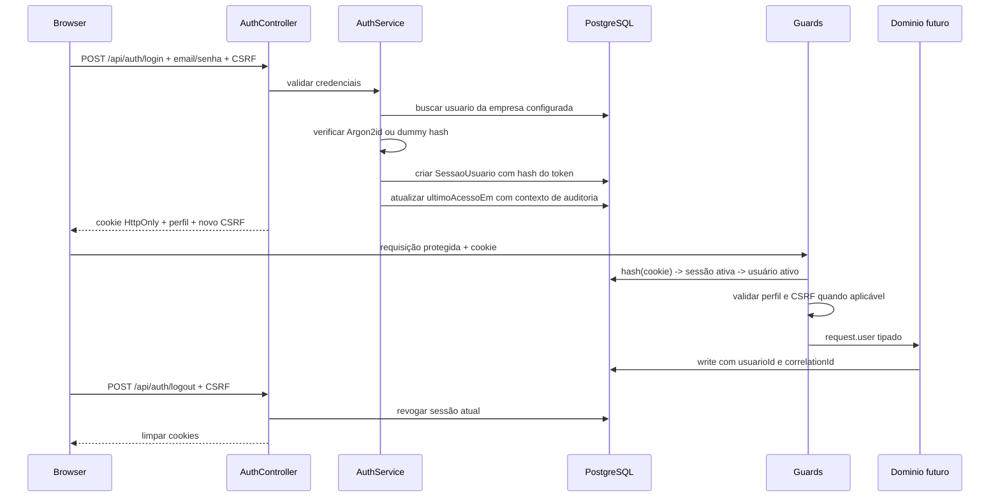

# Semana 1 / Etapa 03 — Autenticação e Autorização

> Runbook normativo da terceira etapa da Semana 1. Este documento trava as decisões de identidade, sessão, autorização, proteção contra abuso e integração com auditoria. **Não substitui implementação** — orienta o trabalho em `appofc/backend/src/auth/` e `appofc/frontend/src/features/auth/`.

---

## Status

| Campo | Valor |
|---|---|
| **Etapa** | `semana1/03-auth-module` |
| **Estado** | **Implementação local concluída** · CI remoto, HTTPS e provisionamento real pendentes |
| **Última atualização** | 24/08/2026 |
| **Norte geral** | [norte-semanal.md](../../norte-semanal.md) |
| **Pré-requisito** | [Etapa 02 — Modelagem e auditoria](../02-modelagem-auditoria/roadmap.md) |
| **Regras de pasta** | [CONTEXTO_AGENTES.md](../../../../CONTEXTO_AGENTES.md) |

O checkbox desta etapa em `norte-semanal.md` permanece `[ ]` até todos os critérios de aceite deste documento serem comprovados. Roadmap pronto **não significa etapa implementada**.

---

## 1. Objetivo

Entregar autenticação individual e autorização por perfil, com uma base segura para todos os módulos seguintes:

- Gislaine autentica com perfil `LANCAMENTO`;
- Cláudia autentica com perfil `EXECUTIVO`;
- cada pessoa usa conta e senha próprias, sem usuário compartilhado;
- a API protege rotas por padrão e libera somente as rotas explicitamente públicas;
- sessões podem expirar e ser revogadas no servidor;
- o navegador nunca recebe senha hash nem armazena credencial em `localStorage`;
- operações autenticadas propagam `usuarioId` e `correlationId` para a auditoria;
- a interface não exibe conteúdo protegido antes de validar a sessão.

**Entregável visível da Semana 1:** ambiente em uma única origem HTTPS, tela de login, sessão persistente durante o uso, logout e identificação clara do perfil autenticado.

---

## 2. Escopo

### 2.1 Entra nesta etapa

- `AuthModule` NestJS isolado;
- login por e-mail e senha;
- senha com hash Argon2id;
- sessão opaca persistida no PostgreSQL;
- cookie de sessão `HttpOnly`;
- expiração por inatividade e expiração absoluta;
- revogação de sessão no logout e na redefinição de senha;
- proteção CSRF em requisições mutáveis;
- limite agressivo de tentativas de login;
- guards globais de autenticação e perfil;
- decorators `@Public()`, `@Roles()` e `@CurrentUser()`;
- `GET /api/auth/me`;
- tela de login e shell autenticado mínimo;
- provisionamento seguro das duas contas por CLI;
- testes unitários, de integração e E2E do fluxo crítico;
- integração do usuário autenticado com `AuditContextService`.

### 2.2 Não entra nesta etapa

- cadastro de usuários pela interface;
- recuperação de senha por e-mail;
- OAuth, SSO, login social ou 2FA;
- refresh token/JWT;
- “lembrar de mim”;
- tela multi-empresa ou seletor de empresa;
- CRUD de fornecedor, categoria, contas ou caixa;
- permissões configuráveis no banco;
- RBAC genérico com dezenas de permissões;
- biometria, WebAuthn ou passkeys;
- integração com NF-e;
- gestão de dispositivos pelo usuário.

### 2.3 Regra de contenção de escopo

Se uma necessidade não for indispensável para autenticar, encerrar sessão, distinguir os dois perfis ou proteger a API, ela não pertence à Etapa 03.

---

## 3. Pré-condições e gates

### 3.1 Pode iniciar localmente quando

- migration da Etapa 02 aplica em banco limpo;
- `Usuario`, `Empresa` e `LogAuditoria` existem;
- `AuditContextService` e `PrismaService.withAuditTransaction()` estão operacionais;
- testes locais da Etapa 02 passam;
- frontend e backend sobem com a mesma estrutura da Etapa 01.

### 3.2 Só pode ser considerada concluída quando

- CI remoto da Etapa 02 estiver verde;
- migration de autenticação estiver aplicada no ambiente;
- a aplicação estiver em uma única origem HTTPS;
- cookies seguros tiverem sido verificados no navegador;
- as contas reais forem provisionadas fora do código-fonte;
- todos os testes obrigatórios passarem.

O desenvolvimento local não depende do domínio oficial. O **aceite de segurança em produção/homologação depende de HTTPS**.

---

## 4. Decisões estratégicas travadas

Estas decisões são norma. Mudança exige justificativa registrada neste arquivo antes da implementação.

| Tema | Decisão | Motivo |
|---|---|---|
| **Sessão** | Token opaco aleatório, persistido somente como hash no PostgreSQL | Revogação real, logout confiável e menor impacto de vazamento do banco |
| **JWT** | Não usar JWT no browser nesta versão | Não há benefício para monolito same-origin; revogação e rotação ficam mais complexas |
| **Armazenamento no browser** | Cookie `HttpOnly`; proibido `localStorage` e `sessionStorage` para autenticação | Reduz takeover por XSS |
| **Senha** | Argon2id; não usar hash rápido, SHA, MD5 nem criptografia reversível | Resistência a ataque offline |
| **Cookie em produção** | `__Host-ad_session`, `HttpOnly`, `Secure`, `SameSite=Lax`, `Path=/`, sem `Domain` | Restringe envio e impede sobrescrita por subdomínio |
| **Cookie em desenvolvimento** | `ad_session`, `HttpOnly`, `SameSite=Lax`, `Path=/`; sem `Secure` apenas em localhost | Desenvolvimento funcional sem enfraquecer produção |
| **CSRF** | Token double-submit assinado, validação de `Origin` e Fetch Metadata em métodos mutáveis | Defesa em camadas para autenticação por cookie |
| **Expiração** | 30 min de inatividade e 12 h absolutas; sem “lembrar de mim” | Equilibra jornada de trabalho e exposição de sessão abandonada |
| **Rotação** | Novo token em todo login; revogar no logout e em reset de senha | Evita session fixation e mantém controle operacional |
| **Autorização** | Guards globais, deny-by-default; somente `@Public()` ignora autenticação | Nova rota não nasce pública por esquecimento |
| **Perfis** | Enum existente `LANCAMENTO` e `EXECUTIVO`; `@Roles()` na API | Backend é a autoridade; esconder botão não é autorização |
| **Tenant** | `empresaId` vem da configuração e da sessão, nunca do body/query do cliente | Evita acesso horizontal entre empresas |
| **Erros de login** | Sempre resposta genérica | Evita enumeração de e-mails, usuários inativos e bloqueados |
| **Auditoria** | Handler autenticado roda com `usuarioId` + `correlationId` em `AsyncLocalStorage` | Atribuição confiável do responsável por cada write |
| **Provisionamento** | CLI interativa com senha oculta; nenhuma senha padrão ou real no seed/git | Evita credencial conhecida, shell history e segredo versionado |
| **Dependências** | Adicionar somente pacotes necessários via bun | Menor superfície de supply chain |

### 4.1 Desvio consciente do handoff da Etapa 02

A Etapa 02 previa “seed de duas usuárias + bcrypt”. A decisão final desta etapa é:

1. usar **Argon2id**, por ser a opção preferencial atual para armazenamento de senha;
2. não colocar senha real em seed;
3. adicionar uma migration pequena para sessões revogáveis e metadados de autenticação;
4. provisionar usuários com um comando operacional explícito.

Esse desvio reduz risco de credencial padrão e evita sessões impossíveis de revogar. Não altera entidades financeiras.

---

## 5. Modelo de ameaça

Contexto: duas usuárias, dados financeiros, desenvolvedor solo, cliente sem equipe de TI e aplicação web same-origin.

### 5.1 Ameaças prioritárias e controles

| Ameaça | Controle obrigatório |
|---|---|
| Roubo de sessão por XSS | Cookie `HttpOnly`; CSP já ativa; nenhum token em storage |
| CSRF | `SameSite=Lax` + Origin/Fetch Metadata + token CSRF assinado |
| Força bruta | throttle por IP e por identificador normalizado; Argon2id; resposta genérica |
| Enumeração de usuário | mesma mensagem/status e verificação com dummy hash |
| Session fixation | token novo criptograficamente aleatório em cada login |
| Token exposto no banco | persistir somente SHA-256 do token aleatório |
| Sessão abandonada | idle timeout + expiração absoluta |
| Usuário inativado ainda acessando | validar estado em toda sessão; revogar sessões ao inativar/resetar |
| Escalada de privilégio | perfil carregado do banco; guard na API; nunca confiar no frontend |
| Cross-tenant | empresa derivada no servidor e verificada nas consultas |
| Senha/cookie em log | redação do Pino + testes negativos |
| Rota nova publicada sem querer | guard global e `@Public()` explícito |
| Auditoria sem ator | interceptor global propaga usuário antes do handler |

### 5.2 Controles deliberadamente adiados

- 2FA/passkeys;
- Redis para rate limit distribuído;
- painel de sessões/dispositivos;
- integração com e-mail;
- detecção comportamental;
- SIEM;
- CAPTCHA.

Antes de escalar para múltiplas instâncias, trocar o armazenamento em memória do throttler por um storage compartilhado. Isso não bloqueia a versão atual de instância única.

---

## 6. Arquitetura do fluxo



### 6.1 Princípios do fluxo

- o token bruto existe apenas no cookie e na memória da requisição;
- o banco armazena apenas o hash do token;
- senha inválida, usuário ausente e usuário inativo percorrem uma resposta indistinguível;
- o perfil retornado ao frontend é informativo; a autorização real ocorre na API;
- a sessão nunca carrega `empresaId` enviado pelo cliente;
- qualquer falha de validação encerra o fluxo antes do controller protegido.

---

## 7. Alterações de dados

### 7.1 Alterações em `Usuario`

Adicionar:

- `ultimoAcessoEm DateTime? @db.Timestamptz(3)`;
- `senhaAlteradaEm DateTime? @db.Timestamptz(3)`.

Não adicionar senha temporária em texto, token de reset ou pergunta secreta.

### 7.2 Novo modelo `SessaoUsuario`

Campos mínimos:

- `id`: UUID;
- `empresaId`: UUID;
- `usuarioId`: UUID;
- `tokenHash`: `Char(64)` ou equivalente, unique;
- `criadaEm`: `Timestamptz`;
- `ultimoUsoEm`: `Timestamptz`;
- `expiraEm`: `Timestamptz`;
- `revogadaEm`: `Timestamptz?`;
- `motivoRevogacao`: string curta nullable.

Índices:

- unique em `tokenHash`;
- `(usuarioId, revogadaEm)`;
- `(expiraEm)`;
- `(empresaId, usuarioId)`.

Constraints:

- FKs com `onDelete: Restrict`;
- FK composta garante que sessão e usuário pertencem à mesma empresa;
- `expiraEm > criadaEm`.

### 7.3 Limites de auditoria da sessão

`SessaoUsuario` é infraestrutura efêmera de segurança, não lançamento financeiro:

- não anexar os triggers de snapshot de domínio;
- nunca registrar `tokenHash` em log;
- registrar login, logout, expiração e revogação como eventos estruturados sem segredo;
- atualização de `Usuario.ultimoAcessoEm` permanece auditada;
- limpeza física de sessões expiradas é permitida depois do período operacional definido.

### 7.4 Migration

Criar uma migration nova, sem editar `20250824194500_init_domain_schema` já existente:

`YYYYMMDDHHMMSS_add_auth_sessions`

A migration deve ser testada:

1. sobre banco limpo;
2. sobre banco já migrado pela Etapa 02;
3. via `prisma migrate deploy` no CI.

---

## 8. Contrato HTTP

### 8.1 `GET /api/auth/csrf`

Rota pública, sem dados sensíveis:

- emite ou renova o cookie CSRF;
- retorna 204 ou payload mínimo;
- usa `Cache-Control: no-store`;
- não cria sessão.

### 8.2 `POST /api/auth/login`

Rota pública com throttle dedicado.

Entrada:

- `email`: obrigatório, trim, lowercase, formato válido, tamanho máximo;
- `senha`: obrigatória, sem trim/normalização, tamanho entre 12 e 128 caracteres.

Saída de sucesso:

- cookie de sessão;
- novo token CSRF vinculado à sessão;
- objeto seguro `{ id, nome, email, perfil }`.

Falha:

- `401` com “E-mail ou senha inválidos” para usuário ausente, senha incorreta, inativo ou empresa inválida;
- `429` para excesso de tentativas, sem confirmar existência da conta;
- nenhuma diferença de shape que permita enumeração.

### 8.3 `GET /api/auth/me`

Rota autenticada:

- retorna somente `id`, `nome`, `email` e `perfil`;
- nunca retorna `senhaHash`, hash de sessão ou metadados internos;
- renova o token CSRF quando necessário;
- responde `401` para sessão ausente, expirada, revogada ou usuário inativo;
- usa `Cache-Control: no-store`.

### 8.4 `POST /api/auth/logout`

Rota autenticada e protegida por CSRF:

- revoga somente a sessão atual;
- limpa cookies usando exatamente os mesmos atributos usados na criação;
- é idempotente;
- retorna `204`;
- não usar logout via `GET`.

### 8.5 Contrato futuro de autorização

As rotas da Semana 2 deverão aplicar:

- `LANCAMENTO`: criar, editar e inativar;
- `EXECUTIVO`: leitura permitida somente onde o requisito autorizar;
- ausência de `@Roles()` em rota autenticada: qualquer perfil autenticado;
- `@Public()`: apenas health, ready, CSRF e login.

---

## 9. Segurança de senha

### 9.1 Política

- mínimo de 12 e máximo de 128 caracteres;
- aceitar frases-senha e espaços;
- não exigir regras arbitrárias como “um símbolo + uma maiúscula”;
- não truncar silenciosamente;
- não aplicar trim nem normalização Unicode na senha;
- nunca logar senha, tamanho da senha ou hash;
- comparar somente por Argon2id.

### 9.2 Parâmetros iniciais Argon2id

Baseline a validar no ambiente Render:

- memória: 64 MiB;
- iterações: 3;
- paralelismo: 1;
- salt aleatório gerado pela biblioteca.

Medir o tempo real no ambiente alvo. Objetivo inicial: aproximadamente 250–500 ms por verificação, sem comprometer memória do serviço. Qualquer redução deve ser registrada com benchmark.

### 9.3 Proteção contra enumeração por tempo

Quando o e-mail não existir:

- executar verificação contra um dummy hash Argon2id válido;
- devolver a mesma resposta de credencial inválida;
- não informar se a conta está inativa;
- não retornar tempos radicalmente diferentes.

---

## 10. Sessão e cookies

### 10.1 Geração e persistência

- gerar 32 bytes com CSPRNG (`randomBytes`);
- codificar em base64url;
- persistir `SHA-256(token)` em hexadecimal;
- consultar sessão sempre pelo hash;
- nunca persistir ou logar o token bruto;
- limitar a três sessões ativas por usuário e revogar a mais antiga ao exceder.

### 10.2 Validação por requisição

Uma sessão só é válida quando:

- hash existe;
- `revogadaEm` é nulo;
- `expiraEm` ainda não passou;
- inatividade não excedeu 30 minutos;
- usuário existe e não está inativado;
- usuário e sessão pertencem à mesma empresa configurada.

Atualizar `ultimoUsoEm` no máximo uma vez a cada cinco minutos para não gerar write em toda requisição.

### 10.3 Cookie

Produção:

```text
__Host-ad_session=<token>; Path=/; HttpOnly; Secure; SameSite=Lax
```

Regras:

- não definir `Domain`;
- não expor token em body ou header de resposta;
- não reutilizar cookie entre ambientes;
- limpar cookie ao detectar sessão inválida;
- não aceitar token em query string, body ou `Authorization`;
- em desenvolvimento, usar nome separado para impedir colisão com produção.

### 10.4 Revogação

Revogar:

- no logout;
- ao redefinir senha;
- ao inativar usuário;
- ao detectar sessão vencida;
- ao exceder o limite de sessões;
- manualmente pelo comando operacional de reset.

---

## 11. CSRF e validação de origem

Para `POST`, `PUT`, `PATCH` e `DELETE`:

- exigir `Content-Type: application/json` quando houver body;
- validar `Origin` contra a origem oficial;
- usar `Sec-Fetch-Site` para rejeitar `cross-site` quando presente;
- exigir header `X-CSRF-Token`;
- comparar em tempo constante com o cookie CSRF;
- assinar o token com segredo de ambiente;
- rotacionar após login;
- nunca reutilizar o segredo de CSRF como senha, token de sessão ou outro segredo.

Variável obrigatória em produção:

- `AUTH_CSRF_SECRET`: aleatória, no mínimo 32 bytes, armazenada apenas no Render.

Se `Origin` estiver ausente em produção para método mutável de navegador, falhar fechado. Exceções futuras para integrações máquina-a-máquina exigem outro mecanismo de autenticação e não entram nesta etapa.

---

## 12. Rate limiting e abuso

### 12.1 Limites

- manter limite global herdado da Etapa 01;
- aplicar limite dedicado ao login;
- chave composta por IP e identificador de e-mail normalizado sem registrar o e-mail puro;
- baseline: 5 tentativas por minuto e 10 por 15 minutos;
- responder `429` com mensagem genérica.

### 12.2 Requisitos de implementação

- o limite deve ocorrer antes do hash caro sempre que possível;
- senha nunca participa da chave;
- logs não devem conter senha, cookie ou token;
- teste deve comprovar que o throttle de login é mais restritivo que o global;
- documentar que o storage padrão é adequado somente à instância única atual.

Não implementar bloqueio permanente de conta: um atacante poderia causar negação de serviço direcionada às duas usuárias.

---

## 13. Autorização por perfil

### 13.1 Componentes obrigatórios

- `Public` decorator;
- `Roles` decorator;
- `SessionAuthGuard` global;
- `RolesGuard` global;
- `CsrfGuard` global para métodos mutáveis;
- `CurrentUser` decorator;
- tipo `AuthenticatedUser` sem campos sensíveis.

### 13.2 Ordem lógica

1. throttling;
2. identificação de rota pública;
3. validação da sessão;
4. validação CSRF quando aplicável;
5. validação do perfil;
6. criação do contexto de auditoria;
7. controller/service.

### 13.3 Deny-by-default

- `health`, `ready`, `auth/csrf` e `auth/login` recebem `@Public()`;
- todas as demais rotas exigem sessão;
- nova rota pública exige anotação explícita e teste;
- frontend nunca substitui guard de backend;
- `empresaId`, `usuarioId` e `perfil` não podem ser sobrescritos por DTO.

---

## 14. Integração com auditoria

### 14.1 Contexto por request

Criar interceptor global depois da autenticação:

- obter `usuarioId` de `request.user`;
- obter ou gerar `correlationId`;
- executar o handler dentro de `AuditContextService.run()`;
- devolver `X-Correlation-Id` seguro na resposta;
- validar formato e tamanho se o cliente enviar correlation ID.

### 14.2 Login

Após validar senha:

1. executar criação da sessão e atualização de `ultimoAcessoEm` em transação;
2. abrir contexto com o próprio `usuarioId`;
3. garantir que o trigger de `Usuario` grave o ator;
4. emitir cookie somente depois do commit.

Se a transação falhar, não emitir sessão.

### 14.3 Eventos de segurança

Registrar de forma estruturada:

- login bem-sucedido;
- login rejeitado;
- logout;
- sessão expirada;
- sessão revogada;
- acesso proibido por perfil;
- throttle acionado.

Não registrar:

- senha ou hash;
- token bruto ou hash de sessão;
- cookie/CSRF;
- body completo do login;
- stack trace para o cliente.

---

## 15. Estrutura alvo

```text
appofc/backend/src/
├── auth/
│   ├── auth.module.ts
│   ├── auth.controller.ts
│   ├── auth.service.ts
│   ├── password.service.ts
│   ├── session.service.ts
│   ├── csrf.service.ts
│   ├── dto/
│   │   └── login.dto.ts
│   ├── decorators/
│   │   ├── current-user.decorator.ts
│   │   ├── public.decorator.ts
│   │   └── roles.decorator.ts
│   ├── guards/
│   │   ├── session-auth.guard.ts
│   │   ├── roles.guard.ts
│   │   └── csrf.guard.ts
│   ├── interceptors/
│   │   └── audit-context.interceptor.ts
│   ├── types/
│   │   └── authenticated-user.ts
│   └── *.spec.ts
├── common/
│   └── middleware/
│       └── correlation-id.middleware.ts
└── scripts/
    ├── provision-user.ts
    ├── reset-user-password.ts
    └── prune-sessions.ts

appofc/frontend/src/
├── features/auth/
│   ├── api/
│   │   └── auth-api.ts
│   ├── components/
│   │   └── ProtectedRoute.tsx
│   ├── hooks/
│   │   └── useAuth.ts
│   ├── pages/
│   │   └── LoginPage.tsx
│   └── types/
│       └── auth.ts
└── app/
    ├── App.tsx
    └── AppProviders.tsx
```

Evitar arquivos genéricos como `utils.ts`. Cada responsabilidade sensível deve ter nome explícito e teste próprio.

---

## 16. Frontend

### 16.1 Estado de autenticação

- TanStack Query é a fonte de verdade de `/auth/me`;
- não duplicar usuário em Redux ou storage;
- CSRF fica em cookie próprio/memória, nunca em storage persistente;
- ao receber `401`, limpar cache autenticado e ir para login;
- ao receber `403`, mostrar acesso negado sem deslogar;
- não repetir automaticamente login ou mutation sensível.

### 16.2 Tela de login

- campos de e-mail e senha;
- autocomplete correto: `username` e `current-password`;
- botão com estado de envio;
- mensagem genérica de falha;
- não indicar conta existente/inativa;
- não preservar senha após erro;
- acessibilidade por teclado e labels;
- sem telemetria do conteúdo dos campos.

### 16.3 Shell autenticado

Exibir apenas:

- nome;
- perfil em linguagem humana;
- botão de logout;
- placeholder da próxima semana.

Não antecipar menus de módulos ainda inexistentes.

### 16.4 Proteção contra flash de conteúdo

Ao iniciar:

1. consultar `/auth/me`;
2. manter estado de carregamento neutro;
3. renderizar shell apenas após sucesso;
4. renderizar login após `401`;
5. não mostrar dados protegidos brevemente durante a checagem.

---

## 17. Provisionamento e operação

### 17.1 Conta da empresa

- usar a `Empresa` criada pelo seed explícito da Etapa 02;
- configurar `AUTH_EMPRESA_ID` no ambiente;
- validar UUID no boot;
- não aceitar `empresaId` na tela de login.

### 17.2 Criação das usuárias

Comando alvo:

```bash
cd appofc
bun run auth:provision-user
```

O comando deve:

- exigir TTY interativo;
- ocultar a senha durante digitação;
- pedir confirmação;
- validar perfil contra o enum;
- normalizar e-mail;
- recusar duplicidade;
- usar Argon2id;
- usar transação auditada;
- imprimir somente ID, e-mail normalizado e perfil;
- nunca imprimir senha ou hash.

Criar:

- Gislaine → `LANCAMENTO`;
- Cláudia → `EXECUTIVO`.

E-mails e senhas reais não entram neste roadmap.

### 17.3 Reset operacional

Enquanto não existe recuperação por e-mail:

```bash
cd appofc
bun run auth:reset-password
```

O reset deve:

- confirmar explicitamente o usuário;
- receber nova senha em prompt oculto;
- atualizar `senhaAlteradaEm`;
- revogar todas as sessões;
- registrar evento sem segredo;
- não revelar se um e-mail arbitrário existe em comando não autenticado — o script é operação administrativa local.

---

## 18. Variáveis de ambiente

Adicionar ao schema Zod e ao `.env.example`, sem valores reais:

- `AUTH_EMPRESA_ID`;
- `AUTH_CSRF_SECRET`;
- `AUTH_SESSION_IDLE_MINUTES` com default 30;
- `AUTH_SESSION_ABSOLUTE_HOURS` com default 12;
- `AUTH_MAX_SESSIONS_PER_USER` com default 3.

Regras:

- produção falha no boot se `AUTH_CSRF_SECRET` for ausente/fraco;
- `AUTH_EMPRESA_ID` deve ser UUID;
- defaults de duração têm limites mínimos e máximos;
- nenhum segredo usa prefixo `VITE_`;
- nenhum segredo entra no frontend;
- testes usam valores próprios e isolados.

---

## 19. Plano de execução

### Fase A — Contrato e migration

- [ ] Fechar contratos HTTP e nomes de cookies
- [ ] Adicionar campos de autenticação em `Usuario`
- [ ] Criar `SessaoUsuario`
- [ ] Gerar migration `add_auth_sessions`
- [ ] Revisar SQL, FKs, índices e constraints
- [ ] Aplicar migration em banco limpo e banco existente

### Fase B — Primitivas de segurança

- [ ] Instalar biblioteca Argon2id via bun
- [ ] Implementar `PasswordService`
- [ ] Implementar geração/hash/revogação de sessão
- [ ] Implementar CSRF assinado
- [ ] Estender validação de env
- [ ] Garantir redação dos novos campos sensíveis

### Fase C — Backend de autenticação

- [ ] Criar `AuthModule`
- [ ] Implementar DTO de login
- [ ] Implementar `/auth/csrf`
- [ ] Implementar `/auth/login`
- [ ] Implementar `/auth/me`
- [ ] Implementar `/auth/logout`
- [ ] Aplicar headers `no-store`
- [ ] Aplicar throttle dedicado

### Fase D — Guards e auditoria

- [ ] Implementar `@Public()`
- [ ] Implementar `SessionAuthGuard` global
- [ ] Implementar `@Roles()` e `RolesGuard`
- [ ] Implementar `CsrfGuard`
- [ ] Implementar `@CurrentUser()`
- [ ] Propagar correlation ID
- [ ] Executar handlers autenticados no `AuditContextService`
- [ ] Confirmar ator na atualização de `ultimoAcessoEm`

### Fase E — Provisionamento

- [ ] Criar CLI de provisionamento
- [ ] Criar CLI de reset
- [ ] Criar limpeza de sessões expiradas
- [ ] Provisionar as duas contas no ambiente alvo
- [ ] Guardar credenciais somente com as respectivas usuárias

### Fase F — Frontend

- [ ] Adaptar `api-client` para cookies same-origin e CSRF
- [ ] Criar API tipada de auth
- [ ] Criar `useAuth`
- [ ] Criar `LoginPage`
- [ ] Criar proteção de rota/shell
- [ ] Implementar logout
- [ ] Tratar `401`, `403`, `429` e erro de rede
- [ ] Impedir flash de conteúdo protegido

### Fase G — Verificação

- [ ] Rodar unitários
- [ ] Rodar integração com PostgreSQL 16
- [ ] Rodar E2E backend
- [ ] Rodar testes frontend
- [ ] Rodar lint, format, typecheck e build
- [ ] Validar cookies no navegador em HTTPS
- [ ] Validar os dois perfis com contas distintas
- [ ] Registrar evidências neste documento

---

## 20. Testes obrigatórios

### 20.1 Senha

- hash gerado usa Argon2id;
- mesma senha produz hashes diferentes;
- senha correta valida;
- senha incorreta falha;
- limites de tamanho são aplicados antes do hash;
- senha e hash não aparecem em logs/exceções.

### 20.2 Login

- credencial válida retorna perfil correto e cookie;
- e-mail é normalizado;
- senha não sofre trim;
- e-mail inexistente retorna o mesmo shape da senha errada;
- usuário inativo retorna resposta genérica;
- usuário de outra empresa não autentica;
- throttle retorna `429`;
- login bem-sucedido atualiza `ultimoAcessoEm`;
- audit trail do update contém o `usuarioId`;
- resposta nunca contém `senhaHash`.

### 20.3 Sessão

- banco armazena hash, não token bruto;
- sessão válida autoriza;
- sessão ausente retorna `401`;
- sessão expirada retorna `401` e limpa cookie;
- sessão revogada retorna `401`;
- inatividade invalida sessão;
- logout revoga e limpa cookie;
- quarto login revoga a sessão ativa mais antiga;
- reset de senha revoga todas as sessões;
- atualização de `ultimoUsoEm` é limitada a uma vez por cinco minutos.

### 20.4 Cookie e CSRF

- produção usa prefixo `__Host-`, `Secure`, `HttpOnly`, `SameSite=Lax`, `Path=/` e sem `Domain`;
- desenvolvimento usa nome separado;
- método mutável sem CSRF retorna `403`;
- token/header divergente retorna `403`;
- origem cross-site retorna `403`;
- `GET /auth/me` não exige CSRF;
- logout via `GET` não existe.

### 20.5 Autorização

- rota sem `@Public()` exige sessão;
- rota `@Public()` funciona sem cookie;
- `LANCAMENTO` acessa rota permitida ao perfil;
- `EXECUTIVO` recebe `403` em rota de escrita;
- perfil enviado por body/header é ignorado;
- `empresaId` enviado pelo cliente é ignorado;
- `401` e `403` são semanticamente distintos.

### 20.6 Concorrência e auditoria

- requests paralelas não vazam `usuarioId`;
- correlation IDs são distintos;
- write do usuário A não é auditado como usuário B;
- falha na transação de login não emite cookie;
- campos de autenticação sensíveis permanecem redigidos.

### 20.7 Frontend

- login envia CSRF e não persiste senha;
- sessão válida renderiza shell;
- `401` volta ao login;
- `403` não causa loop de login;
- logout limpa estado do TanStack Query;
- carregamento inicial não exibe conteúdo protegido;
- perfil exibido corresponde a `/auth/me`.

---

## 21. Comandos de verificação

Usar os scripts reais definidos no monorepo; ajustar nomes somente se necessário e registrar a mudança:

```bash
cd appofc
docker compose up -d
bun install
bun run prisma:validate
bun run prisma:migrate:deploy
bun run lint
bun run typecheck
bun run test
DATABASE_URL=.../autodisplay_test bun run test:integration
bun run build
```

Verificação manual em HTTPS:

1. inspecionar flags do cookie;
2. confirmar ausência de token em Local Storage e Session Storage;
3. autenticar Gislaine e conferir `LANCAMENTO`;
4. autenticar Cláudia e conferir `EXECUTIVO`;
5. tentar mutation sem CSRF;
6. encerrar sessão e confirmar que o cookie antigo não volta a autenticar;
7. conferir logs sem senha/cookie/token;
8. conferir `LogAuditoria` com usuário no update de último acesso.

---

## 22. Critério de aceite

Marcar a etapa como concluída em `norte-semanal.md` somente quando todos forem verdade.

### Backend

- [ ] AuthModule isolado e importado no AppModule
- [ ] Argon2id configurado e testado
- [ ] Sessão opaca revogável; token bruto ausente do banco
- [ ] Login, me e logout operacionais
- [ ] Guards globais deny-by-default
- [ ] Perfis `LANCAMENTO` e `EXECUTIVO` validados na API
- [ ] CSRF e validação de origem ativos
- [ ] Throttle dedicado ativo
- [ ] Usuário inativo não autentica
- [ ] Reset de senha revoga sessões

### Dados e auditoria

- [ ] Migration nova commitada e aplicada via deploy
- [ ] Sessão respeita empresa/usuário por constraint
- [ ] `ultimoAcessoEm` auditado com ator correto
- [ ] Requests concorrentes não misturam contexto
- [ ] Nenhum segredo aparece em auditoria ou logs

### Frontend

- [ ] Tela de login funcional e acessível
- [ ] Estado derivado de `/auth/me`
- [ ] Nenhuma credencial em Local/Session Storage
- [ ] Logout funcional
- [ ] Sem flash de conteúdo protegido
- [ ] Nome e perfil da pessoa autenticada visíveis

### Ambiente

- [ ] Duas contas individuais provisionadas
- [ ] Aplicação validada em uma única origem HTTPS
- [ ] Cookie de produção possui todas as flags obrigatórias
- [ ] Segredos existem somente no ambiente
- [ ] CI verde: lint, format, typecheck, testes, build, migration

### Escopo negativo

- [ ] Nenhum CRUD financeiro antecipado
- [ ] Nenhuma tela multi-empresa
- [ ] Nenhum JWT/localStorage
- [ ] Nenhuma senha padrão ou real no repositório
- [ ] Nenhuma rota artificial criada apenas para “demonstrar” perfil

---

## 23. Riscos e mitigação

| Risco | Impacto | Mitigação | Residual |
|---|---|---|---|
| Argon2 pesado no plano Render | Latência/memória | Benchmark e parâmetros explícitos | Ataques ainda consomem recurso; throttle reduz |
| Throttler em memória reinicia | Limite perde histórico | Instância única + Argon2 + logs | Migrar para storage compartilhado antes de escalar |
| Sessão no PostgreSQL adiciona consulta | Latência por request | Índice por token hash; touch limitado | Aceitável para duas usuárias |
| CSRF complexo no frontend | Falhas de integração | Cliente HTTP central e testes E2E | Manutenção exige seguir o padrão |
| Cookie seguro sem HTTPS | Login falha em produção | Aceite exige HTTPS; nome separado em dev | Deploy/domínio ainda é dependência externa |
| CLI administrativa mal executada | Conta errada/reset indevido | Confirmação explícita e logs sem segredo | Operação continua humana |
| Perfil usado só na UI | Escalada de privilégio | Guards obrigatórios na API | Revisão necessária em cada módulo |
| `empresaId` vindo do cliente | Cross-tenant | Contexto exclusivamente server-side | Futuro multi-empresa exigirá resolução formal |
| Escopo de segurança excede 19 h da semana | Atraso | Não cortar controles críticos; replanejar capacidade | Buffer global é apertado |

---

## 24. Estimativa e decisão de prazo

Estimativa realista desta etapa: **8–10 horas**.

Distribuição aproximada:

- migration e sessão: 1,5–2 h;
- senha, CSRF e rate limit: 1,5–2 h;
- endpoints, guards e auditoria: 2–2,5 h;
- frontend: 1,5–2 h;
- testes, deploy e evidências: 1,5–2 h.

As Etapas 01 e 02 foram estimadas em 6–8 h cada. Portanto, a Semana 1 completa tende a consumir **20–26 h**, acima das 19 h originais.

**Decisão estratégica:** não reduzir segurança de senha, sessão, CSRF, autorização ou testes para caber artificialmente na estimativa. O desvio deve ser absorvido por replanejamento explícito, sem roubar silenciosamente o buffer das Semanas 7–9.

---

## 25. Handoff para a Semana 2

Os módulos de categoria, fornecedor e contas a pagar devem herdar:

- autenticação global por sessão;
- `request.user` tipado;
- `empresaId` derivado da sessão;
- writes permitidos somente a `LANCAMENTO`;
- auditoria com `usuarioId` e `correlationId`;
- CSRF em toda mutation;
- DTOs sem `usuarioId`, `empresaId` ou `perfil` controláveis pelo cliente;
- erros `401` para não autenticado e `403` para perfil insuficiente;
- cliente HTTP único no frontend;
- logout e tratamento central de sessão expirada.

Antes do primeiro CRUD da Semana 2, criar um teste de arquitetura simples que falhe se um controller novo não estiver coberto pelos guards globais.

---

## 26. Registro de execução

| Data | O que foi feito | Pendências |
|---|---|---|
| 24/08/2026 | Roadmap normativo criado; sessões opacas, Argon2id, CSRF, deny-by-default, provisionamento seguro e critérios de aceite definidos | Toda implementação, testes, provisionamento, CI e validação HTTPS |
| 24/08/2026 | Implementação concluída: migration `add_auth_sessions`, AuthModule (login/me/logout), guards globais, CSRF double-submit, Argon2id, frontend AuthGate/LoginPage, CLIs operacionais, testes unitários/integração/e2e | Validar CI remoto; deploy HTTPS; cookies `__Host-*` em produção; provisionar Gislaine e Cláudia via `auth:provision-user` |

### Decisões aplicadas na implementação

- **Sessões opacas** em `SessaoUsuario` com SHA-256; cookie `HttpOnly`; revogação no logout/reset.
- **Argon2id** via `@node-rs/argon2` (substitui bcrypt previsto no handoff da Etapa 02).
- **CSRF double-submit** com cookie assinado + header `X-CSRF-Token` + validação de `Origin`.
- **Guards globais** deny-by-default; `@Public()` em health, ready, csrf e login.
- **Frontend** sem React Router: `AuthGate` + TanStack Query como fonte de `/auth/me`.
- **Provisionamento** via CLI interativa (`auth:provision-user`); nenhuma senha real no repositório.

### Evidências locais (24/08/2026)

- [ ] `bun run prisma:validate`
- [ ] `bun run prisma:migrate:deploy`
- [ ] `bun run lint`
- [ ] `bun run typecheck`
- [ ] `bun run test`
- [ ] `bun run test:db:prepare && DATABASE_URL=.../autodisplay_test bun run test:integration`
- [ ] `DATABASE_URL=.../autodisplay_test bun run test:e2e` (backend)
- [ ] Link CI run ___ (pendente push/Actions)
- [ ] Login Gislaine (`LANCAMENTO`) em HTTPS ___
- [ ] Login Cláudia (`EXECUTIVO`) em HTTPS ___

---

## Referências

- [Requisitos do módulo financeiro](../../../base/Requisitos_AutoDisplay_Modulo_Financeiro.md)
- [Planejamento e arquitetura](../../../base/AutoDisplay_Planejamento_Arquitetura.md)
- [Norte semanal](../../norte-semanal.md)
- [Etapa 01 — Setup técnico](../01-setup-tecnico/roadmap.md)
- [Etapa 02 — Modelagem e auditoria](../02-modelagem-auditoria/roadmap.md)
- [Contexto para agentes](../../../../CONTEXTO_AGENTES.md)
